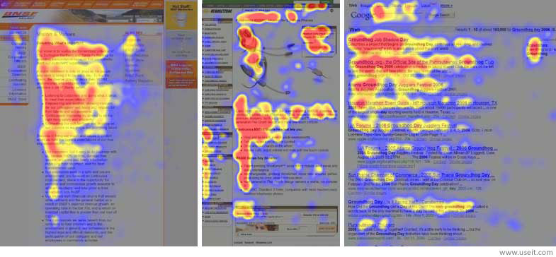

# Como estruturar os elementos de uma aplicação com os padrões F e Z

Existem dois formatos que podemos utilizar quando estruturamos os elementos de uma aplicação. Os formatos que iremos abordar são baseados nos movimentos dos nossos olhos e podem ser aplicados dentro do contexto da cultura ocidental (leitura da esquerda para direita). Essas diretrizes acabam por definir quais são os pontos mais nobres de um conteúdo, ou seja, aqueles que devem conter as informações mais importantes.

## Padrões “F”

Os padrões “F” se aplicam a páginas tradicionais com muitos textos, como artigos ou postagens em blogs.

Um leitor escaneia o lado esquerdo da página, procurando por palavras-chave interessantes em cabeçalhos alinhados à esquerda ou frases de tópicos iniciais, depois para em um ponto e segue lendo em linha à direita, parando quando encontra algo interessante.

O resultado se parece com um “F” (ou “E,” ou algo com ainda mais barras horizontais; mas o termo “F” pegou).

Como você pode utilizar isso? Use negrito, itálico, cores ou sublinhado com moderação para destacar informações cruciais. Isso ajuda a guiar os olhos dos leitores para os pontos-chave.

---

### Momento anúncio 😁🤘

Quer aprender desenvolvimento frontend do zero?

O [eFront](https://iuricode.com/efront/) é um ebook criado por mim onde eu ensino **HTML, CSS, JavaScript, Sass, Bootstrap, React, React Router, TypeScript, styled-components, Tailwind CSS, React Hook Form, Radix UI, Storybook, Cypress e Next.js**. Tudo isso é ensinado com uma didática simples que até quem está iniciando na área consegue aprender a utilizar cada tecnologia do ebook.

Mais de **9.000 pessoas já compraram**, você vem comigo?

👉 **[Acessar o link da venda](https://iuricode.com/efront/)**

---

## Padrões “Z”

Os padrões “Z” se aplicam a outros tipos de páginas, como anúncios ou sites, em que as informações não são necessariamente apresentadas em parágrafos em bloco.

O olho de um leitor primeiro escaneia a parte superior da página, onde é possível encontrar informações importantes, depois dispara para o canto oposto na diagonal e faz a mesma coisa na parte inferior da página.

Por isso é quase um padrão universal que os sites sigam esse comportamento, colocando as informações mais importantes nos cantos e orientando outras informações importantes nas barras superior e inferior.

## Conclusão

É importante entender como os seus usuários fazem a leitura das informações antes de adotar um padrão. Considere também uma mistura dos padrões mencionados no artigo para chegar a uma solução ideal. Uma boa hierarquia visual irá diminuir o processo cognitivo dos usuários e destacar os pontos mais importantes para que concluam suas tarefas de uma forma mais eficaz.

---

E aí, gostou da postagem? Me manda um feedback no [Instagram](https://www.instagram.com/iuricode/) para melhorar cada vez mais! 😁

Esse projeto é **[open source](https://github.com/iuricode/blog)**, então basta adicionar uma nova feature e abrir um pull-request. Dessa maneira você irá contribuir com a comunidade.
