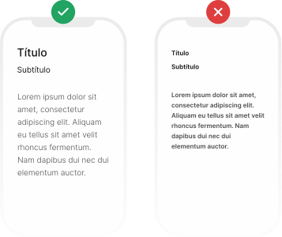
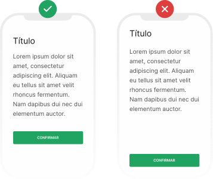
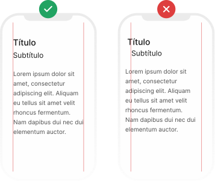
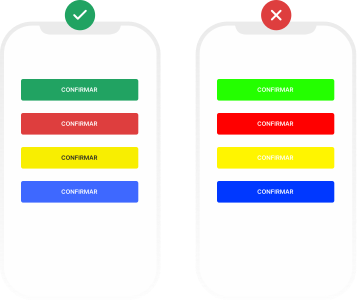
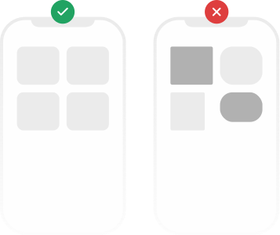
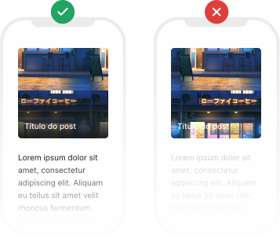

# Dicas de design para melhorar suas aplicações frontend

## Hierarquia

A hierarquia ajuda na definição do grau de importância. Quando um elemento de design possui várias informações, é importante dar mais peso para o que é mais importante.

## Proximidade

Neste princípio temos a base de que informações similares devem estar próximas, ou seja, manter o conteúdo principal próximo das informações secundárias. Fica claro que esses itens pertencem a um grupo e não a outro mais distante.

## Alinhamento

Ao inserir informações em um layout precisamos ter em mente que mantê-las organizadas é fundamental para a compreensão do usuário, e o alinhamento ajuda muito nisso.

## Cores

Um dos princípios mais importantes é o tom da cor. Ela também é responsável por transmitir emoções, simbolismos e identificar elementos. A paleta de cores precisa ser cuidadosamente escolhida, para transmitir a ideia da marca, sua atmosfera e atrair o público.

---

### Momento anúncio 😁🤘

Quer aprender desenvolvimento frontend do zero?

O [eFront](https://iuricode.com/efront/) é um ebook criado por mim onde eu ensino **HTML, CSS, JavaScript, Sass, Bootstrap, React, React Router, TypeScript, styled-components, Tailwind CSS, React Hook Form, Radix UI, Storybook, Cypress e Next.js**. Tudo isso é ensinado com uma didática simples que até quem está iniciando na área consegue aprender a utilizar cada tecnologia do ebook.

Mais de **9.000 pessoas já compraram**, você vem comigo?

👉 **[Acessar o link da venda](https://iuricode.com/efront/)**

---

## Repetição

O princípio da repetição visa fortalecer o padrão visual, ou seja, o alinhamento, o contraste e a proximidade devem ser iguais nas artes seguintes. Assim você seguirá mantendo a consistência da marca.

## Contraste

O contraste é o responsável por dar relevância visual ao que deve ser atrativo. Um exemplo é você colocar uma imagem com letras em branco por cima, se na imagem tiver cores claras não teremos contraste, ou seja, não há uma diferenciação de cores.

## Espaçamento

Deixar espaços em branco é tão importante quanto todo o resto. Uma determinada quantidade de texto, por exemplo, precisa de espaço para respirar, para que o leitor não se canse ao lê-lo.

---

E aí, gostou da postagem? Me manda um feedback no [Instagram](https://www.instagram.com/iuricode/) para melhorar cada vez mais! 😁

Esse projeto é open source, então basta adicionar uma nova feature e abrir um pull-request. Dessa maneira você irá contribuir com a comunidade.
